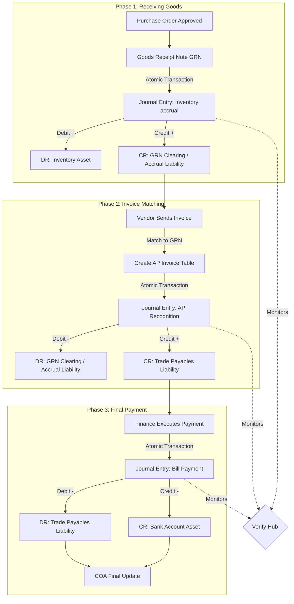

# Master System Contract: Procurement & AP (Accounts Payable) Pipeline 🚀

This maps how vendor bills (Yutong, external suppliers) hit the ledger.

```mermaid
graph TD
    subgraph Phase 1: Receiving Goods
        PO[Purchase Order Approved] --> GRN[Goods Receipt Note GRN]
        GRN -->|Atomic Transaction| JE_GRN[Journal Entry: Inventory accrual]
        
        JE_GRN -->|Debit +| DR_INV[DR: Inventory Asset]
        JE_GRN -->|Credit +| CR_ACCRUAL[CR: GRN Clearing / Accrual Liability]
    end

    subgraph Phase 2: Invoice Matching
        CR_ACCRUAL --> AP_BILL[Vendor Sends Invoice]
        AP_BILL -->|Match to GRN| AP_RECORD[Create AP Invoice Table]
        AP_RECORD -->|Atomic Transaction| JE_BILL[Journal Entry: AP Recognition]
        
        JE_BILL -->|Debit -| DR_ACCRUAL[DR: GRN Clearing / Accrual Liability]
        JE_BILL -->|Credit +| CR_AP[CR: Trade Payables Liability]
    end

    subgraph Phase 3: Final Payment
        CR_AP --> PAY[Finance Executes Payment]
        PAY -->|Atomic Transaction| JE_PAY[Journal Entry: Bill Payment]
        
        JE_PAY -->|Debit -| DR_AP[DR: Trade Payables Liability]
        JE_PAY -->|Credit -| CR_BANK[CR: Bank Account Asset]
        
        DR_AP --> COA[COA Final Update]
        CR_BANK --> COA
    end
    
    %% Integrity Guard
    VH{Verify Hub}
    JE_GRN -.->|Monitors| VH
    JE_BILL -.->|Monitors| VH
    JE_PAY -.->|Monitors| VH
```
