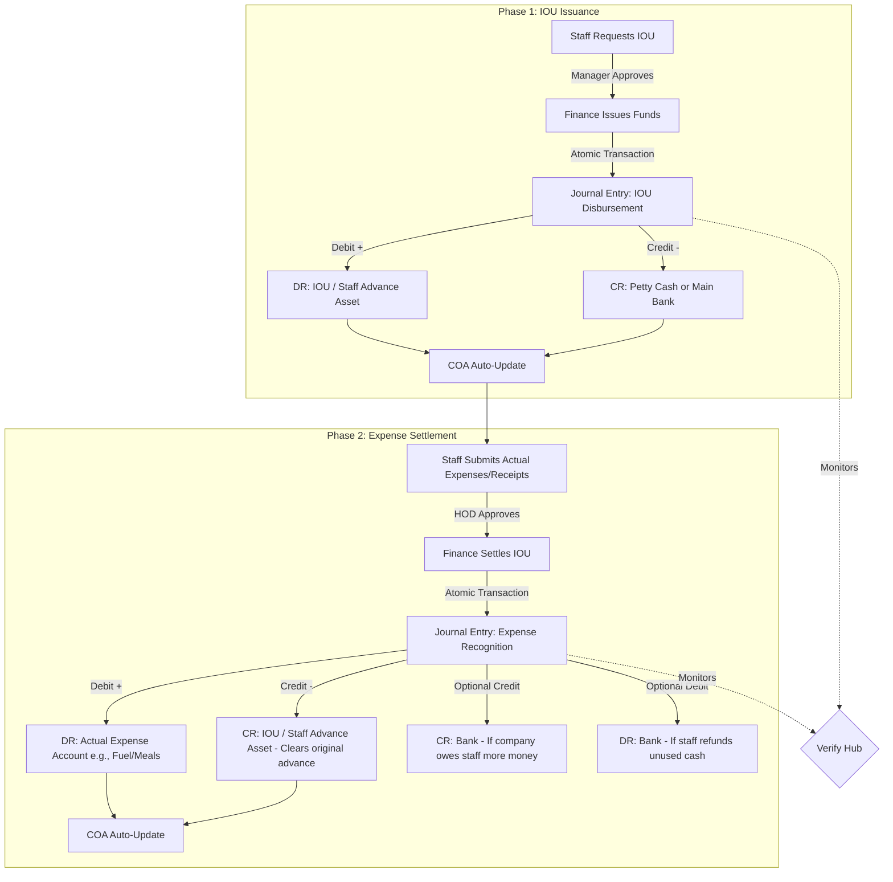

# Master System Contract: IOU & Staff Expense Pipeline 🚀

This maps exactly how staff advances are issued, expensed, and settled.

```mermaid
graph TD
    %% Phase 1: Issuing the Advance
    subgraph Phase 1: IOU Issuance
        REQ[Staff Requests IOU] -->|Manager Approves| ISSUE[Finance Issues Funds]
        ISSUE -->|Atomic Transaction| JE_ISSUE[Journal Entry: IOU Disbursement]
        
        JE_ISSUE -->|Debit +| DR_ADV[DR: IOU / Staff Advance Asset]
        JE_ISSUE -->|Credit -| CR_BANK[CR: Petty Cash or Main Bank]
        
        DR_ADV --> COA_ISSUE[COA Auto-Update]
        CR_BANK --> COA_ISSUE
    end

    %% Phase 2: Expense Submission
    subgraph Phase 2: Expense Settlement
        COA_ISSUE --> EXP[Staff Submits Actual Expenses/Receipts]
        EXP -->|HOD Approves| SETTLE[Finance Settles IOU]
        
        SETTLE -->|Atomic Transaction| JE_SETTLE[Journal Entry: Expense Recognition]
        
        JE_SETTLE -->|Debit +| DR_EXP[DR: Actual Expense Account e.g., Fuel/Meals]
        
        %% Splitting the Credit based on over/under spending
        JE_SETTLE -->|Credit -| CR_ADV_CLEAR[CR: IOU / Staff Advance Asset - Clears original advance]
        JE_SETTLE -->|Optional Credit| CR_BANK_EXTRA[CR: Bank - If company owes staff more money]
        JE_SETTLE -->|Optional Debit| DR_BANK_REFUND[DR: Bank - If staff refunds unused cash]
        
        DR_EXP --> COA_FINAL[COA Auto-Update]
        CR_ADV_CLEAR --> COA_FINAL
    end
    
    %% Integrity Guard
    VH{Verify Hub}
    JE_ISSUE -.->|Monitors| VH
    JE_SETTLE -.->|Monitors| VH
```
