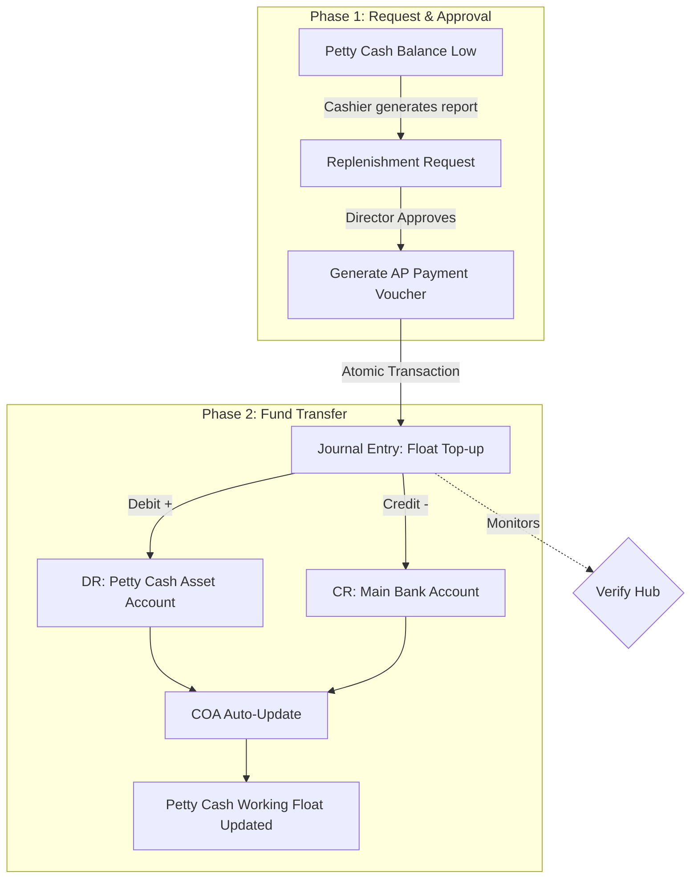

# Master System Contract: Petty Cash Replenishment Pipeline 🚀

This maps how the Petty Cash float is securely topped up from the main bank.

```mermaid
graph TD
    subgraph Phase 1: Request & Approval
        LOW[Petty Cash Balance Low] -->|Cashier generates report| REQ[Replenishment Request]
        REQ -->|Director Approves| AP_VOUCHER[Generate AP Payment Voucher]
    end

    subgraph Phase 2: Fund Transfer
        AP_VOUCHER -->|Atomic Transaction| JE_REPLENISH[Journal Entry: Float Top-up]
        
        JE_REPLENISH -->|Debit +| DR_PC[DR: Petty Cash Asset Account]
        JE_REPLENISH -->|Credit -| CR_BANK[CR: Main Bank Account]
        
        DR_PC --> COA[COA Auto-Update]
        CR_BANK --> COA
        
        COA --> FLOAT_UPDATE[Petty Cash Working Float Updated]
    end
    
    %% Integrity Guard
    VH{Verify Hub}
    JE_REPLENISH -.->|Monitors| VH
```
