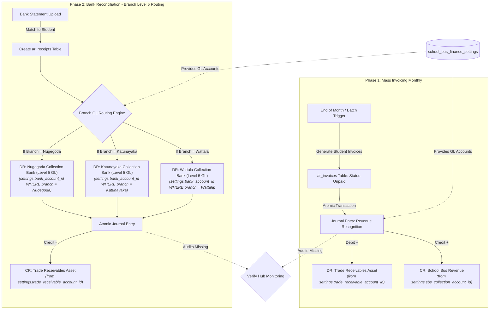

# Master System Contract: School Bus AR Pipeline 🚀

This maps exactly how mass invoicing works for student transport and explicitly shows the Branch-Level Level 5 GL routing engine.

```mermaid
graph TD
    Settings[(school_bus_finance_settings)]
    Settings -.->|Provides GL Accounts| JE_INV
    Settings -.->|Provides GL Accounts| ROUTER

    subgraph Phase 1: Mass Invoicing Monthly
        CRON[End of Month / Batch Trigger] -->|Generate Student Invoices| AR_INV[ar_invoices Table: Status Unpaid]
        AR_INV -->|Atomic Transaction| JE_INV[Journal Entry: Revenue Recognition]
        
        JE_INV -->|Debit +| DR_INV["DR: Trade Receivables Asset<br/><i>(from settings.trade_receivable_account_id)</i>"]
        JE_INV -->|Credit +| CR_INV["CR: School Bus Revenue<br/><i>(from settings.sbs_collection_account_id)</i>"]
    end

    subgraph Phase 2: Bank Reconciliation - Branch Level 5 Routing
        BANK[Bank Statement Upload] -->|Match to Student| PAY[Create ar_receipts Table]
        
        PAY --> ROUTER{Branch GL Routing Engine}
        
        ROUTER -->|If Branch = Wattala| W_BANK["DR: Wattala Collection Bank (Level 5 GL)<br/><i>(settings.bank_account_id WHERE branch = Wattala)</i>"]
        ROUTER -->|If Branch = Katunayaka| K_BANK["DR: Katunayaka Collection Bank (Level 5 GL)<br/><i>(settings.bank_account_id WHERE branch = Katunayaka)</i>"]
        ROUTER -->|If Branch = Nugegoda| N_BANK["DR: Nugegoda Collection Bank (Level 5 GL)<br/><i>(settings.bank_account_id WHERE branch = Nugegoda)</i>"]
        
        W_BANK --> JE_PAY[Atomic Journal Entry]
        K_BANK --> JE_PAY
        N_BANK --> JE_PAY
        
        JE_PAY -->|Credit -| CR_BANK_AR["CR: Trade Receivables Asset<br/><i>(from settings.trade_receivable_account_id)</i>"]
    end
    
    VH{Verify Hub Monitoring}
    JE_INV -.->|Audits Missing| VH
    JE_PAY -.->|Audits Missing| VH
```
