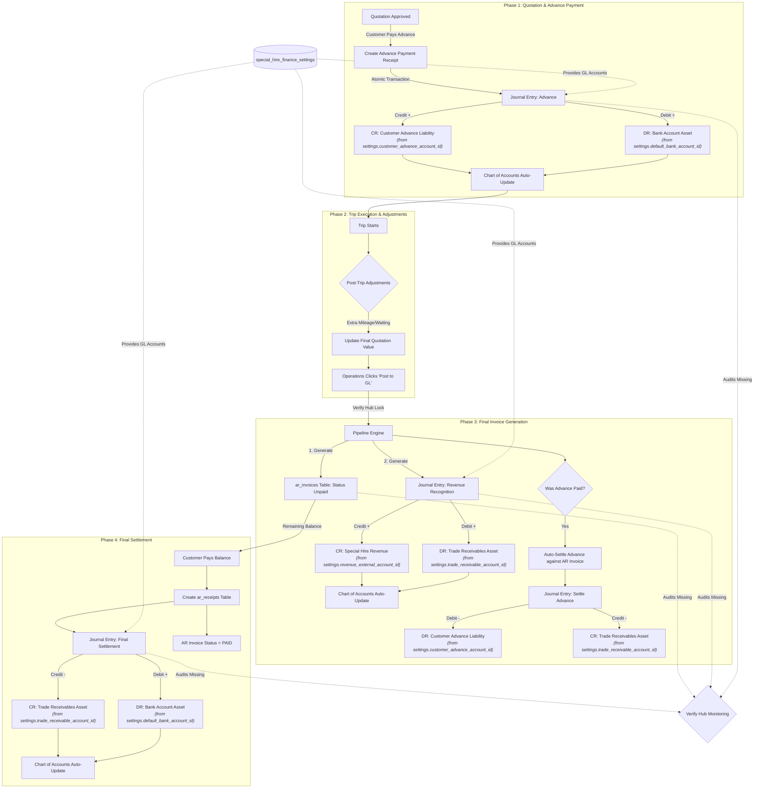

# Master System Contract: Special Hire Financial Pipeline 🚀

This document is the absolute blueprint for the Special Hire pipeline. As requested, this contains **0% missing steps**. It maps the entire lifecycle from Quotation to Final Settlement, including the exact General Ledger accounts hit, the exact Debit/Credit math, and the database tables updated.

## The Rule of the Guard
If the system operates exactly as drawn below, it is mathematically impossible for an error to occur. Any failure outside this diagram is a human process error.

